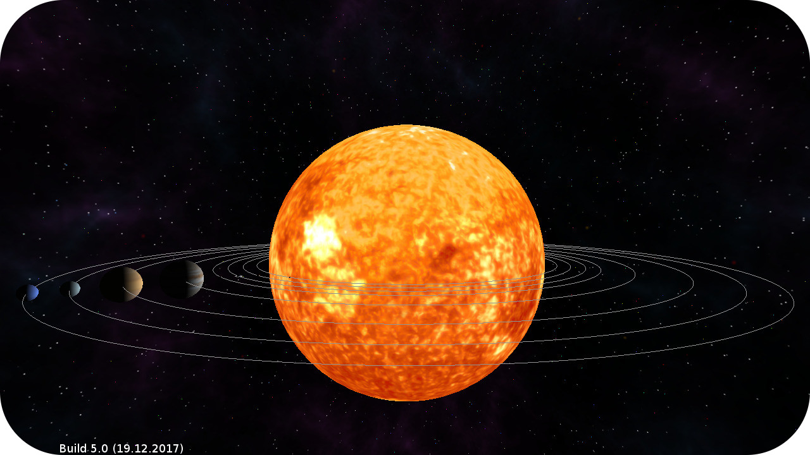

# Solar Sys
Computergraphics WiSe 17/18
  

  
## Current features
Everything marked with [] is an optional task.
  
----
#### Assignment 1  
- [x] Planets (8 planets, 1 sun, 1 moon)
- [x] [Camera controls]
----
#### Assignment 2  
- [x] Stars
- [x] New Shader for stars
- [x] [Displaying the orbit of planets]
----
#### Assignment 3  
- [x] Planet colors
- [x] Blinn-Phong local illumination model for planet fragment shader
- [x] [Cel-shading effect]
- [x] [Colored border/outline for each planet (other than the background)]
- [x] [Switching between Phong and cel-shading using the number keys "1" and "2"]
----
#### Assignment 4  
- [x] Planet texturing
- [x] Skybox or Skysphere
- [x] [Normal mapping for the least one planet]
----
#### Assignment 5  
- [x] Render with Frame Buffer
- [x] Effect: luminance preserving grayscale image (Key: 7)
- [x] Effect: horizontally mirrored image (Key: 8)
- [x] Effect: vertically mirrored image (Key: 9)
- [x] Effect: blurred image with 3x3 gaussian kernel (Key: 0)
- [x] [Allow all possible combinations of the effects]
----
#### Assignment 6 (optional)  
- [x] Uniform Buffer Object to pass View- and Projection-Matrices to shaders
- [ ] [light struct in Phong shader and Storage Block for dynamic array of lights]
- [ ] [use the lights from the beforementioned array]

...

> to be continued!

...

----
  
  
## Controls
  
#### Camera Movement
* W = move forward
* S = move backward
* A = move left
* D = move right
* SPACEBAR = move up
* C = move down
* MOUSE UP/DOWN = turn camera up/down
* MOUSE LEFT/RIGHT = turn camera left/right
* SHIFT = hold to double the speed while moving
  
#### Rendering
* T = toggle textures
* N = toggle normal mapping
* O = toggle planet orbits
* 1 = use blinn-phong shading
* 2 = use cel-shading
  
#### Effects
* 7 = toggle effect: luminance preserving grayscale
* 8 = toggle effect: horizontally mirrored image
* 9 = toggle effect: vertically mirrored image
* 0 = toggle effect: blurred image with 3x3 gaussian kernel
  
  
## Tested Platforms
* **Linux**
* **Windows**
  
  
## Used Libraries
* [**GLFW**](http://www.glfw.org/) for window and context creation
* [**glbinding**](https://github.com/cginternals/glbinding) for OpenGL function binding
* [**GLM**](glm.g-truc.net/) for mathematics
* [**tinyobjloader**](http://syoyo.github.io/tinyobjloader/) for model loading
* [**stb_image**](https://github.com/nothings/stb) for image loading
  
----
  
## License
this framework is licensed under the GPL v3
* **GLFW** is licensed under the zlib/libpng license
* **glbinding** is licensed under the MIT license
* **glm** is licensed under the Happy Bunny License (Modified MIT)
* **tinyobjloader** is licensed under 2 clause BSD
* **stb_image** is public domain
  
  
## Maintainers
- Leon H.
- Marcel H.
